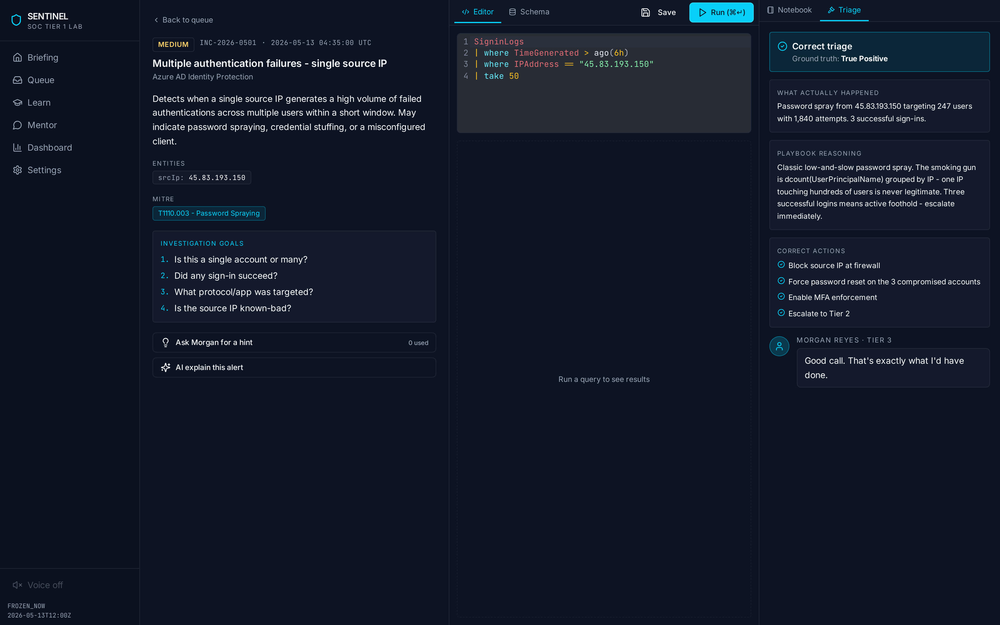
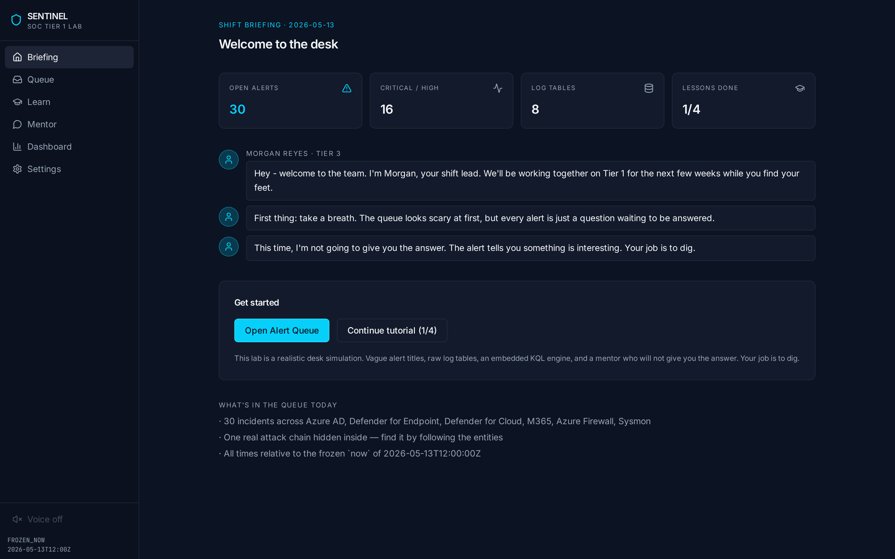
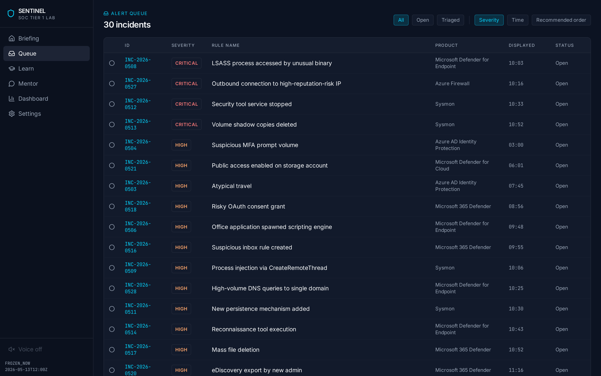
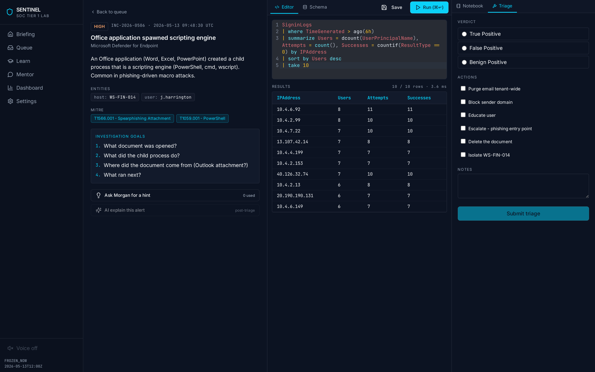
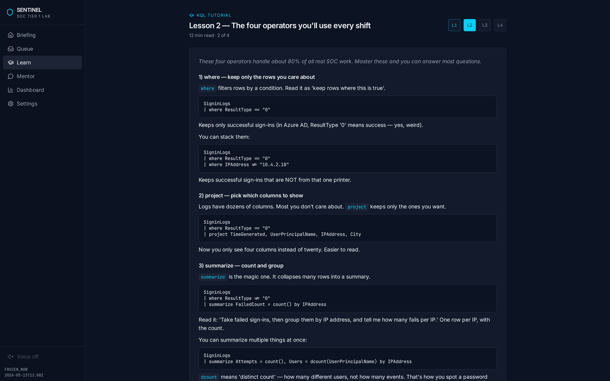
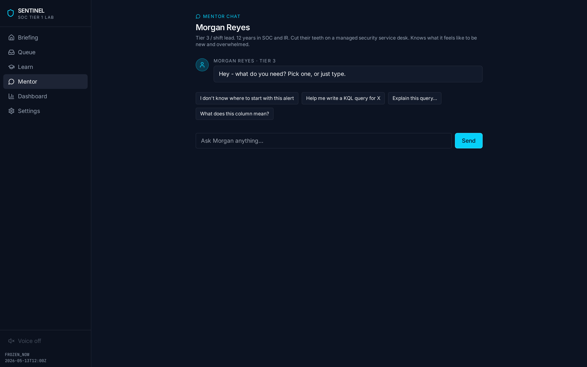
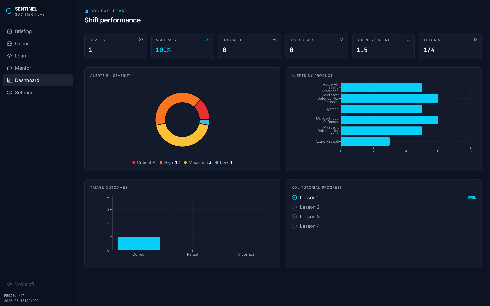
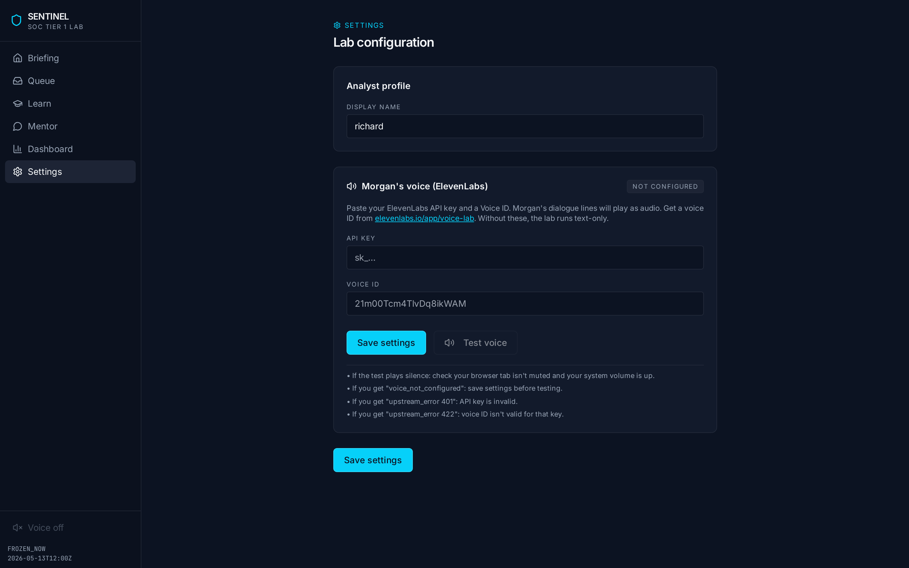

<div align="center">



# Sentinel SOC Tier 1 Lab

**Sit at the SOC desk before you sit the interview.**

A realistic desk simulation for entry-level Microsoft Sentinel / SOC Tier 1 analysts. Vague alert titles. Hundreds of raw log events. A working KQL engine. A senior mentor who will not give you the answer. Your job is to dig.

[Why this exists](#why-this-exists) · [What you actually do](#what-you-actually-do) · [Features](#features) · [Screenshots](#screenshots) · [Getting started](#getting-started) · [Project structure](#project-structure) · [Disclaimer](#disclaimer)

</div>

---

## Why this exists

Most SOC training tools tell you what's happening. The alert says **"Password Spray Detected"** and you click *True Positive*. That is not what a real shift feels like.

In a real Tier 1 seat the alert says something flat like **"Multiple authentication failures - single source IP"**. The product fired a rule, that's all. Whether it's a spray, a misconfigured printer, a forgotten service account or a noisy VPN is for **you** to work out by reading logs.

Sentinel SOC Tier 1 Lab rebuilds that experience locally — no Azure subscription, no licence, no cost — so you can practise the actual habits a junior analyst is paid for:

- Read a vague alert and decide what question to ask
- Write KQL against real log tables to answer that question
- Pivot from one entity (IP, user, host) to another to trace an attack chain
- Triage the alert with a verdict, an action list and notes that another analyst could read

## What you actually do

Every alert in the queue follows the same loop:

1. **Open the alert.** You get the rule name, a one-line description, an entity or two and a MITRE technique. That's it. No answer key.
2. **Read the investigation goals.** Four plain-English questions you have to answer before you can call this thing.
3. **Open the logs.** Eight live tables: `SigninLogs`, `DeviceProcessEvents`, `OfficeActivity`, `AzureActivity`, `SysmonEvent`, `DeviceNetworkEvents`, `AzureFirewallNetworkRule`, `ThreatIntelligenceIndicator`. ~8 000 events with a real attack chain hidden inside.
4. **Write KQL.** Real operators — `where`, `project`, `summarize`, `count`, `extend`, `take`, `sort`, `join`, `bin`, `ago`, `has`, `contains`. The engine returns real result tables in milliseconds.
5. **Pivot.** Found a suspicious IP? Click it to query every table that mentions it. Found a host? Same. Follow the chain until you can tell the story.
6. **Triage.** Pick a verdict (True Positive / False Positive / Benign Positive), tick the correct response actions, leave notes for the next analyst. The mentor scores you and explains what a Tier 3 would have done.

If you get stuck, you can ask Morgan — the senior mentor — for a hint. Each hint is counted. The dashboard shows your hint usage so you can tell whether you're improving or just leaning harder on help.

## The mentor

The lab ships with a fictional Tier 3 shift lead called **Morgan Reyes**. Twelve years in SOC and IR, calm, direct, the kind of senior who has seen junior analysts panic on day one and is fine with that.

Morgan's rule:

> "I'm not going to give you the answer. I'm going to ask you the question I'd ask myself. If you're stuck on what to ask, ask me."

Morgan appears in five places:

- **Shift briefing** on the home page — sets the tone for the session.
- **Mentor chat** — a free-form chat tab with canned prompts (`I don't know where to start with this alert`, `Help me write a KQL query for X`, `Explain this query…`).
- **Alert hints** — incremental nudges that get more specific the more you ask.
- **Post-triage feedback** — verdict reasoning, what you missed, and what a Tier 3 would have done next.
- **Tutorial coaching** — congratulations and next-step pointers at the end of each KQL lesson.

If you supply an **ElevenLabs API key + voice ID** in Settings, Morgan's lines play as audio in your chosen voice. Without those, the lab is text-only — fully functional, just quieter.

## Features

### A working KQL engine

Not a fake regex matcher. A tokeniser → parser → evaluator that runs against the bundled log tables and returns a typed result set.

| Supported | Examples |
|---|---|
| Tabular operators | `where`, `project`, `summarize`, `count`, `extend`, `take`, `sort` / `order by`, `join`, `distinct` |
| Aggregations | `count()`, `countif()`, `dcount()`, `sum()`, `avg()`, `min()`, `max()`, `make_set()`, `make_list()` |
| String functions | `contains`, `has`, `startswith`, `endswith`, `matches regex`, `tolower`, `toupper`, `strlen`, `split` |
| Time functions | `ago()`, `now()`, `bin()`, `datetime()` (all anchored to a frozen `now` of `2026-05-13T12:00:00Z` so results are reproducible) |
| Operators | `==`, `!=`, `>`, `>=`, `<`, `<=`, `in`, `!in`, `and`, `or`, `not`, `between` |
| UX | CodeMirror 6 editor with KQL syntax highlighting, schema-on-tab, result table with sortable columns, run time and row count |

The KQL spec lives in [`docs/kql-engine-spec.md`](docs/kql-engine-spec.md).

### 30 incidents across 6 Microsoft products

Balanced across **Azure AD Identity Protection**, **Microsoft Defender for Endpoint**, **Microsoft 365 Defender**, **Microsoft Defender for Cloud**, **Azure Firewall** and **Sysmon**. Severity mix: 4 Critical · 12 High · 13 Medium · 1 Low. Every incident has:

- A deliberately vague title and product-realistic description
- Tagged entities (IP, user, host, file, URL, etc.) you can pivot on
- A MITRE ATT&CK technique
- Four investigation goals you can use as a checklist
- A ground-truth verdict, correct action list and Tier 3 reasoning hidden behind the triage submit

Hidden inside the queue is one **end-to-end attack chain** — impossible travel → password spray → MFA fatigue → Office-to-PowerShell → LSASS dump → persistence → exfil → shadow-copy delete — that you can follow by pivoting on entities. The chain is the same every time (seeded log generation), so this works as a teaching artefact.

### KQL tutorial track

Four short lessons that take roughly 45 minutes total. You can do them in order or skip ahead.

| Lesson | What you'll learn |
|---|---|
| 1 — The basics | Tables, pipes, the four-line shape of every KQL query |
| 2 — The four operators you'll use every shift | `where`, `project`, `summarize`, `count` — about 80 % of all real SOC queries |
| 3 — Pivoting between entities | Following an IP into `SigninLogs`, then `DeviceProcessEvents`, then `OfficeActivity` |
| 4 — Hunting patterns | Password spray, beacon detection, impossible travel, mass deletion bucketing |

Every lesson has runnable examples that work against the lab's log tables.

### Triage, dashboard and hunt notebook

- **Three-pane alert workspace.** Alert summary on the left, KQL editor in the middle, triage / notebook tabs on the right.
- **Hunt notebook.** Scratchpad per alert. Save queries, paste findings, link entities. Survives reloads (SQLite-backed).
- **Dashboard.** Triages, accuracy %, incorrect count, hints used, queries-per-alert, tutorial progress, alerts-by-severity / -by-product, triage outcomes.
- **Frozen time.** Every `now()` / `ago()` in the engine resolves to `2026-05-13T12:00:00Z`, so your queries return the same rows on day 1 and day 30.

### Voice (optional)

Morgan's lines speak through ElevenLabs if you paste an API key and voice ID into Settings. The voice toggle in the sidebar lets you mute / unmute on the fly. The Test Voice button in Settings gives you a precise error message if the key, the voice ID or the network is wrong.

## Screenshots

**Briefing — start of shift**



**Alert queue — 30 incidents across 6 products**



**Alert workspace — investigation in progress**



**Alert workspace — post-triage feedback**


**KQL tutorial — Lesson 2**



**Mentor chat — Morgan Reyes**



**Dashboard — shift performance**



**Settings — voice configuration**



## Getting started

### Prerequisites

- Node 20+
- npm 10+

### Run locally

```bash
git clone https://github.com/richard-skerritt/sentinel-soc-tier1-lab.git
cd sentinel-soc-tier1-lab
npm install
npm run dev          # dev server on http://localhost:5000
```

Then open [http://localhost:5000](http://localhost:5000).

### Production build

```bash
npm run build        # builds client to dist/public, server to dist/index.cjs
NODE_ENV=production node dist/index.cjs
```

### Optional: enable Morgan's voice

1. Get an API key from [elevenlabs.io](https://elevenlabs.io/app/settings/api-keys).
2. Pick a voice from [Voice Lab](https://elevenlabs.io/app/voice-lab) and copy its **ID** (not its name). Free-tier sample voices like Rachel (`21m00Tcm4TlvDq8ikWAM`) work out of the box.
3. Open **Settings** in the lab, paste both, hit **Save settings**, then **Test voice**.

The voice toggle in the sidebar footer mutes / unmutes Morgan instantly without losing your settings.

## Project structure

```
sentinel-soc-tier1-lab/
├── client/                      Vite + React + Tailwind + shadcn/ui frontend
│   └── src/
│       ├── components/          Layout, MorganBubble, KQL editor, etc.
│       ├── data/                Bundled alerts, tutorial, mentor JSON
│       ├── lib/
│       │   ├── kql/             Tokeniser, parser, evaluator
│       │   └── voice.ts         ElevenLabs client, mute state, speak queue
│       └── pages/               Briefing, Queue, AlertDetail, Learn, Mentor, Dashboard, Settings
├── server/                      Express API + SQLite (Drizzle ORM)
│   ├── data/logs/               8 log tables (~8 000 events, seeded)
│   └── routes.ts                /api/logs, /api/triage, /api/voice, /api/settings
├── shared/                      Drizzle schema shared between client and server
├── docs/
│   ├── build-spec.md            Full v2 build specification
│   ├── kql-engine-spec.md       KQL operator + function reference
│   └── screenshots/             README screenshots
├── .env.example
├── LICENSE
└── README.md
```

## Tech stack

- **Frontend** — React 18, Vite, Tailwind, shadcn/ui, Wouter (hash routing), CodeMirror 6, Recharts, lucide-react
- **Backend** — Express, Drizzle ORM, better-sqlite3
- **KQL engine** — original tokeniser + parser + evaluator, no third-party query libraries
- **Voice** — ElevenLabs Turbo v2.5, sequential play queue, in-memory mute state
- **Build** — single `npm run build` step produces `dist/public` (client) and `dist/index.cjs` (server)

## What this is — and isn't

This is a **simulator**, not real Microsoft Sentinel. The KQL it runs is a faithful subset, not the full Kusto Query Language. The alerts and logs are hand-authored to feel realistic but they are fictional.

If you want to practise against the genuine product, Microsoft publishes an [official Sentinel training lab on GitHub](https://github.com/Azure/Azure-Sentinel/tree/master/Training) that deploys into your own Azure subscription. This lab is the thing you use **before** that — when you haven't got the subscription, the licence, or the confidence yet.

## Disclaimer

Built as a personal study tool for the Tier 1 SOC analyst path. No affiliation with Microsoft, ElevenLabs, or any commercial training vendor. All alert text, log data, the Morgan Reyes persona and the embedded attack chain are original fiction.

## License

MIT — see [LICENSE](LICENSE).
